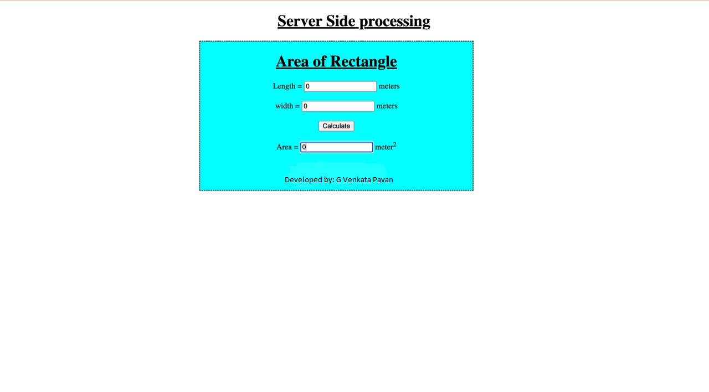

# Design a Website for Server Side Processing

## AIM:
To design a website to perform mathematical calculations in server side.

## DESIGN STEPS:

### Step 1:
Create a Django project.

### Step 2:
Create an App named mathapp.

### Step 3:
In mathapp create a folder named template.In template folder create an anoter folder named mathapp.

### Step 4:
Create a html document in the mathapp.

### Step 5:
In the html document design the page as required for getting the input values for doing mathematical calculation.

### Step 6:
Add the formula in views.py.

### Step 7:
Link the html document to urls.py

### Step 8:
Publish the website in the url: http://gvenkatapavan.student.saveetha.in:8000

## PROGRAM :
### Html Code:
~~~
<!DOCTYPE html>
<html>
<head>
    <meta charset='utf-8'>
    <meta http-equiv='X-UA-Compatible' content='IE=edge'>
    <title>AREA</title>
    <meta name='viewport' content='width=device-width, initial-scale=1'>
    <link rel='stylesheet' type='text/css' media='screen' href='main.css'>
</head>
<body>
<h1>Area of the rectangle</h1>
<form method="POST">
    Length =<input type="text" name="length"></input> 
    Breadth =<input type="text" name="breadth"></input> 
    <input type="submit" value="CalculateArea"></input> 
    Area=<input type="text" name="Area"></input> 

</form>
        <footer>
            Developed by: G Venkata Pavan
        </footer>
</body>
</html>
~~~
### urls.py
~~~
"""Calculations URL Configuration

The `urlpatterns` list routes URLs to views. For more information please see:
    https://docs.djangoproject.com/en/3.1/topics/http/urls/
Examples:
Function views
    1. Add an import:  from my_app import views
    2. Add a URL to urlpatterns:  path('', views.home, name='home')
Class-based views
    1. Add an import:  from other_app.views import Home
    2. Add a URL to urlpatterns:  path('', Home.as_view(), name='home')
Including another URLconf
    1. Import the include() function: from django.urls import include, path
    2. Add a URL to urlpatterns:  path('blog/', include('blog.urls'))
"""
from django.contrib import admin
from django.urls import path
from mathapp import views
urlpatterns = [
    path('admin/', admin.site.urls),
    path('areaofrectangle/',views.areacalculation,name='areaofrectangle')
]

~~~
### views.py:
~~~
from django.shortcuts import render

# Create your views here.
def areacalculation(request):
    context = {}
    return render(request,'mathapp/area.html',context)

~~~
## OUTPUT:

## Result:

